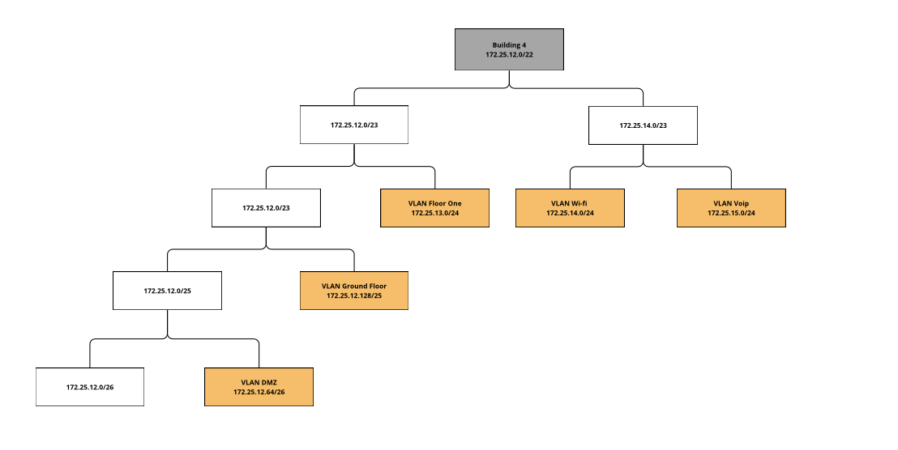
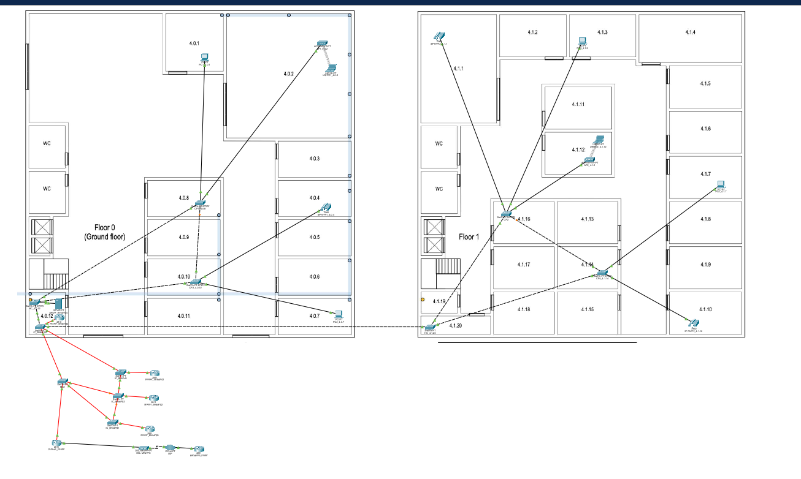
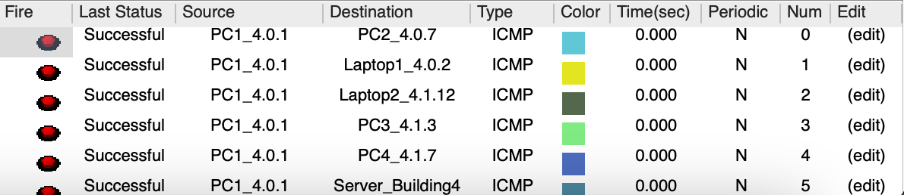

## RCOMP 2023-2024 Project - Sprint 2 - Member 1220741 folder

# Building 4

- 30m × 30m = 900 m²

### Document Organization:

- Schematic Vlan Ip distribution tree

- Packet Tracer Simulation
  - Relevant justifications
- Network configuration
- Especifications
  - End Devices on each Vlan
  - Devices Used
- Pings
- Equipment Used
- Configuration Router And Switchs Files

## VLAN database  and IPv4 Network

## Schematic Vlan Ip distribution:

| VLAN ID | VLAN  Name    | Nodes | Network Ip       | First host    | Last host     | Broadcast     | Subnet Mask     |
|---------|---------------|-------|------------------|---------------|---------------|---------------|-----------------|
| 421     | 4_GroundFloor | 120   | 172.25.12.128/25 | 172.25.12.129 | 172.25.12.254 | 172.25.12.255 | 255.255.255.128 |
| 422     | 4_FloorOne    | 150   | 172.25.13.0/24   | 172.25.13.1   | 172.25.13.254 | 172.25.13.255 | 255.255.255.0   |
| 423     | 4_Wifi        | 190   | 172.25.14.0/24   | 172.25.14.1   | 172.25.14.254 | 172.25.14.255 | 255.255.255.0   |
| 424     | 4_DMZ         | 40    | 172.25.12.64/26  | 172.25.12.65  | 172.25.12.126 | 172.25.12.127 | 255.255.255.192 |
| 425     | 4_Voip        | 170   | 172.25.15.0/24   | 172.25.15.1   | 172.25.15.254 | 172.25.15.255 | 255.255.255.0   |

## Packet Tracer Simulation

**Relevant Justifications**:

- The number of nodes did not have any influence on the sorting criteria.

This solution allows for future expansion in building 4 if needed, because the network **172.12.0/26** is empty, which can be divided into more networks as necessary.

## Specifications

The implementation of the proposed requirements for building 4 begins with the switch named IC_Building4, which establishes a connection to two other switches representing **floors 0 and 1** (HC_4.0.12 and HC_4.1.20, respectively).

All ports that are not connected to end devices are configured in **trunk mode**,all ports connected to an End device are in **access mode** with as they connect only to a sinlge Vlan:

### Example for vlan with **id 421:** 

### End Devices On each Vlan:
In the configurations of the two HCs and all CPS of the building, the following VLANs have been associated with end devices:

## Devices Used:

| Device Type | Device Name        | VLAN | IPv4 Address  |
|-------------|--------------------|------|---------------|
| PC          | PC1_4.0.1          | 421  | 172.25.12.130 |
| PC          | PC2_4.0.7          | 421  | 172.25.12.131 |
| PC          | PC4_4.1.7          | 422  | 172.25.13.2   |
| PC          | PC3_4.1.3          | 422  | 172.25.13.3   |
| Laptop      | Laptop1_4.0.2      | 423  | 172.25.14.2   |
| Laptop      | Laptop2_4.1.12     | 423  | 172.25.14.3   |
| Server      | Server_Building4   | 424  | 172.25.12.64  |

# Pings:
### PC1 - All Devices

### PC2 - All Devices

### Laptop1- All Devices

### Laptop2- All Devices

### Server - All Devices

## Equipment Used:

| Hardware                   | Packet Tracer    |
|----------------------------|------------------|
| Main Cross-Connect         | Switch-PT-Empty  |
| Intermediate Cross-connect | Switch-PT-Empty  |
| Horizontal Cross-connect   | Switch-PT-Empty  |
| Consolidation Point        | Switch-PT-Empty  |
| Access Point               | AccessPoint-PT   |
| Router                     | 2811             |
| ISP Router                 | 2811             |
| PC                         | PC-PT            |
| Laptop                     | Laptop-PT        |
| Server                     | Server-PT        |
| Phone                      | 7960             |

# Configuration of Routers and Switches Files:

The configuration files for all the switches and routers required for the proper functioning of the structured cabling project of building 4 can be found at this link: [Configuration Files](config-files)

