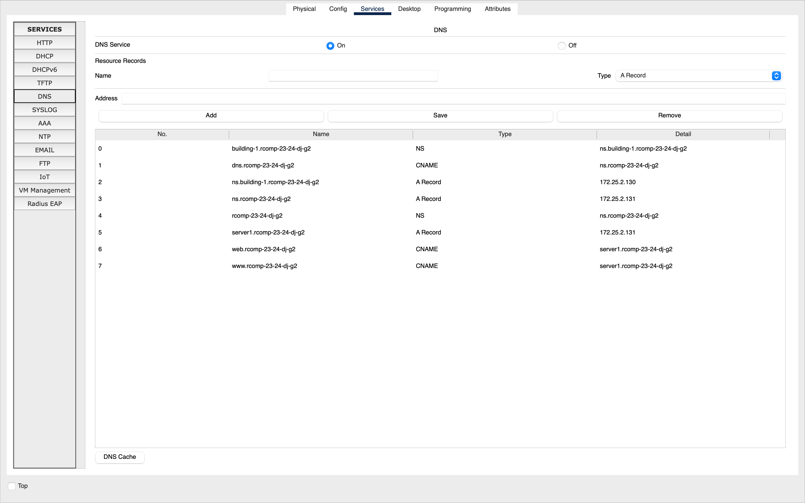

# RCOMP 2023-2024 Project - Sprint 3 - Building 1 Configuration

## Member 1211895

## Diogo Nunes

## *OSPF Dynamic Routing*
- Static routing is no longer used. Therefore, in each router, the existing static routing tables were erased, except for the default route that connects to the ISP (as without this route, there would be no internet distribution on campus).

- The overall infrastructure is now an OSPF domain, divided into OSPF areas: one for each building and the backbone area (area 0).

### Configuration of Building 1 Router:
```
router ospf 1
network 172.25.0.0 0.0.0.255 area 0
network 172.25.2.0 0.0.0.127 area 1
```

### Configuration of Building 2 Router:
```
router ospf 2
network 172.25.0.0 0.0.0.255 area 0
network 172.25.5.0 0.0.0.255 area 2
```    

### Configuration of Building 3 Router:
```
router ospf 3
network 172.25.0.0 0.0.0.255 area 0
network 172.25.9.0 0.0.0.255 area 3
```    

### Configuration of Building 4 Router:
```
router ospf 4
network 172.25.0.0 0.0.0.255 area 0
network 172.25.13.0 0.0.0.255 area 4
```    

### Configuration of Backbone Router:
```
router ospf 5
network 172.25.0.0 0.0.0.255 area 0
default-information originate
```    

## *HTTP Servers*
- In the VLAN DMZ, another server was added to handle the HTTP service.

- On this server, the HTTP service was enabled and a simple HTML page identifying the building was added.


## *DHCPv4 Service*
- The router in each building provides the DHCPv4 service to all local networks (within the building), except for the DMZ and backbone networks, where IPv4 addresses are static and manually defined.

- For the VoIP VLAN, the DHCP server configuration includes option 150, which represents the IP address of the TFTP (Trivial File Transfer Protocol) server to be used by the phones.

- All computers and laptops now receive network configuration via DHCP.

### Floor 0
```
ip dhcp pool 1f1
network 172.25.1.0 255.255.255.128
default-router 172.25.1.1
dns-server 172.25.2.130
domain-name rcomp-23-24-dj-g2
```

### Floor 1
```
ip dhcp pool 1f2
network 172.25.1.128 255.255.255.128
default-router 172.25.1.129
dns-server 172.25.2.130
domain-name rcomp-23-24-dj-g2
```

### *Wi-Fi*
```
ip dhcp pool 1wifi
network 172.25.2.0 255.255.255.128
default-router 172.25.2.1
dns-server 172.25.2.130
domain-name rcomp-23-24-dj-g2
```

### *VoIP*
```
ip dhcp pool 1voip
network 172.25.3.0 255.255.255.128
default-router 172.25.3.1
option 150 ip 172.25.3.1
dns-server 172.25.2.130
domain-name rcomp-23-24-dj-g2
```

### Excluded Gateway Addresses
```
ip dhcp excluded-address 172.25.1.1
ip dhcp excluded-address 172.25.1.129
ip dhcp excluded-address 172.25.2.1
ip dhcp excluded-address 172.25.3.1
```

## *VoIP Service*
### Configuration of Switches
- On the switch ports connecting to phones, the voice VLAN was activated and the access VLAN was deactivated.

#### *hc1.0*
```
interface FastEthernet0/7
switchport mode access
switchport voice vlan 409
no switchport access vlan
```

#### *hc1.1*
```
interface FastEthernet0/7
switchport mode access
switchport voice vlan 409
no switchport access vlan
```

### Automatic Phone Registration and Directory Number Assignment
- With DHCP already configured, it was necessary only to configure the telephony service and assign phone numbers on the building's router.

```
telephony-service
auto-reg-ephone
ip source-address 172.25.3.1 port 2000
max-ephones 30
max-dn 30
auto assign 1 to 2
      
ephone-dn 1
number 1001
      
ephone-dn 2
number 1002
```

With the VoIP phones added and configured on the network, they can now communicate with each other.


## *DNS*
- The server set up in the last sprint is used as a DNS server.

- Within the DNS database, all names are FQDN (fully qualified domain names), so all defined names end with *rcomp-23-24-dj-g2*.

- The HTTP server was named *server1* (A record). Within the DNS domain, there are two aliases *www* and *web* (CNAME), both mapped to *server1* (A record) of the same domain. There is an additional alias, named *dns* (CNAME), mapped to the ns of the domain (A record).

- The IPv4 of the DNS server was manually added to the servers.

**DNS Table configured on server 1 of building 1:**

| No. | Name                             | Type    | Detail                          |
|-----|----------------------------------|---------|---------------------------------|
| 0   | building-1.rcomp-23-24-dj-g2     | NS      | ns.building-1.rcomp-23-24-dj-g2 |
| 1   | dns.rcomp-23-24-dj-g2            | CNAME   | ns.rcomp-23-24-dj-g2            |
| 2   | ns.building-1.rcomp-23-24-dj-g2  | A Record| 172.25.2.130                    |
| 3   | ns.rcomp-23-24-dj-g2             | A Record| 172.25.2.131                    |
| 4   | rcomp-23-24-dj-g2                | NS      | ns.rcomp-23-24-dj-g2            |
| 5   | server1.rcomp-23-24-dj-g2        | A Record| 172.25.2.131                    |
| 6   | web.rcomp-23-24-dj-g2            | CNAME   | server1.rcomp-23-24-dj-g2       |
| 7   | www.rcomp-23-24-dj-g2            | CNAME   | server1.rcomp-23-24-dj-g2       |



## *NAT (Network Address Translation)*
- Static NAT was used to redirect traffic, so the requested configurations were applied on the building's router.

- HTTP and HTTPS requests received on the backbone interface of the router are redirected to the HTTP server in the local DMZ. Both HTTP and HTTPS use TCP connections and assume that the standard port numbers for the service are used, 80 and 443.

```
ip nat inside source static tcp 172.25.2.131 80 172.25.0.1 80
ip nat inside source static tcp 172.25.2.131 443 172.25.0.1 443
```

- DNS requests received on the backbone interface of the router are redirected to the DNS server in the local DMZ. The DNS service uses TCP and UDP connections, and in both cases, the standard port number for the service is 53.

```
ip nat inside source static tcp 172.25.2.130 53 172.25.0.1 53
ip nat inside source static udp 172.25.2.130 53 172.25.0.1 53
```

- Each VLAN was included in the created NAT, except for the backbone.

```
interface FastEthernet0/0.6
ip nat outside

interface FastEthernet0/0.1
ip nat inside

interface FastEthernet0/0.2
ip nat inside
 
interface FastEthernet0/0.3
ip nat inside

interface FastEthernet0/0.4
ip nat inside

interface FastEthernet0/0.5
ip nat inside

```

## *Static Firewall (ACLs)*

- ACLs will be implemented in the router of each building. They will be particularly restrictive to traffic exchanged with the local DMZ and traffic destined for the router itself.

### Backbone
```
access-list 100 deny ip 172.25.2.0 0.0.0.127 any
access-list 100 permit ospf any host 172.25.0.1
access-list 100 permit udp any host 172.25.0.1 eq 53
access-list 100 permit tcp any host 172.25.0.1 eq 53
access-list 100 permit tcp any host 172.25.0.1 eq 80
access-list 100 permit tcp any host 172.25.0.1 eq 443
access-list 100 permit tcp any host 172.25.0.1 eq 2000
access-list 100 deny ip any host 172.25.0.1
access-list 100 permit ip any any
```

### Floor 0
```
access-list 101 permit ip host 0.0.0.0 host 255.255.255.255					
access-list 101 permit ip 172.25.1.0 0.0.0.127 any
```

### Floor 1
```
access-list 102 permit ip host 0.0.0.0 host 255.255.255.255
access-list 102 permit ip 172.25.1.128 0.0.0.127 any
```

### Wi-Fi
```
access-list 103 permit ip host 0.0.0.0 host 255.255.255.255
access-list 103 permit ip 172.25.2.0 0.0.0.127 any
```

### DMZ
```
access-list 104 deny ip 172.25.2.128 0.0.0.127 any
access-list 104 permit udp any host 172.25.2.130 eq 53
access-list 104 permit tcp any host 172.25.2.130 eq 53
access-list 104 permit tcp any host 172.25.2.131 eq 80
access-list 104 permit tcp any host 172.25.2.131 eq 443
```

### VoIP
```
access-list 105 permit ip host 0.0.0.0 host 255.255.255.255
access-list 105 permit udp 172.25.3.0 0.0.0.127 host 172.25.0.1 eq 69
access-list 105 permit tcp 172.25.3.0 0.0.0.127 host 172.25.0.1 eq 2000
access-list 105 permit ip 172.25.3.0 0.0.0.127 any
```

### Grouping of *ACLs*:

```
interface FastEthernet0/0.6
ip access-group 100 in

interface FastEthernet0/0.1
ip access-group 101 in

interface FastEthernet0/0.2
ip access-group 102 in

interface FastEthernet0/0.3
ip access-group 103 in

interface FastEthernet0/0.4
ip access-group 104 out

interface FastEthernet0/0.5
ip access-group 105 in
```