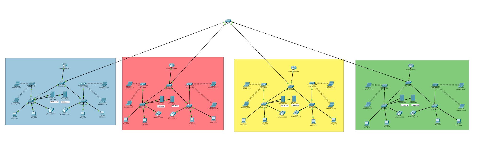
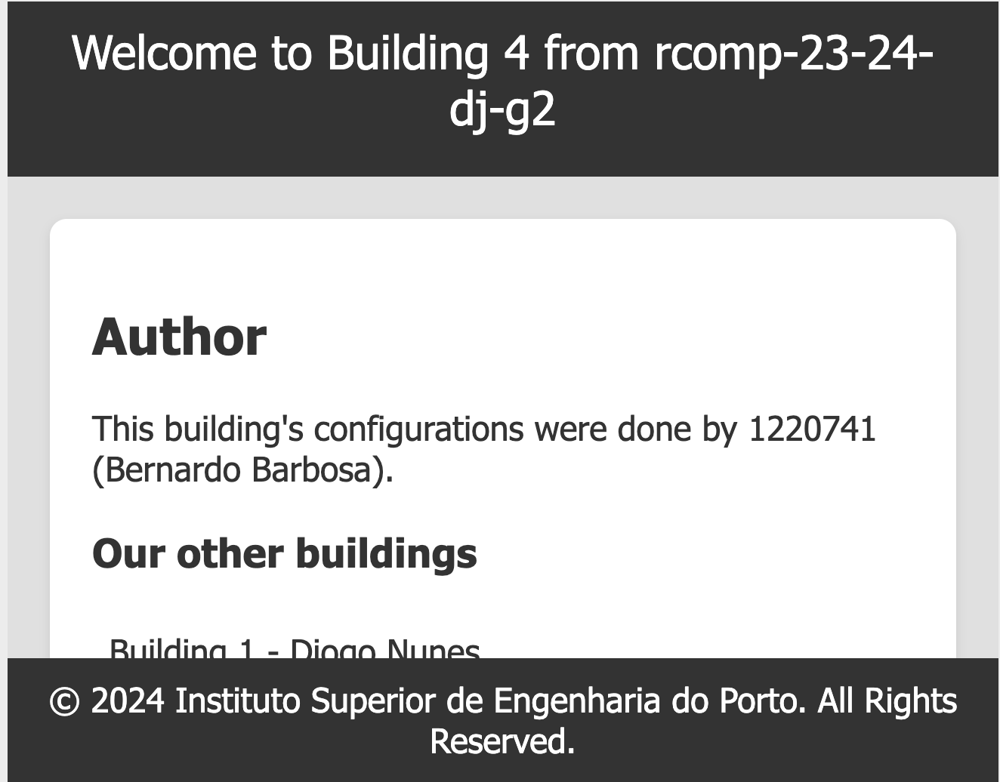

## RCOMP 2023-2024 Project - Sprint 2 - Member 1220741 folder

# Building 4


- 30m × 30m = 900 m²


### Document Organization:

- Schematic Campus Overview

- Packet Tracer Simulation
  - OSPF dynamic routing
  - HTTP Server
  - DHCPv4 service
  - Voip Service
  - DNS
  - Nat
  - ACLS

- Startup and Configuration Router Files


## 1- Packet Tracer Simulation


## OSPF dynamic routing

- Static routing is no longer utilized, thus in each router, the existing static routing tables have been cleared, except for the default route that connects to the ISP (as without this route there would be no internet distribution on the campus).
- The overall infrastructure is now an OSPF domain, divided into OSPF areas, one for each building and the backbone area (area 0).


### Router_Building4 Configuration.
```
router ospf 4
network 172.25.0.0 0.0.0.255 area 0   (Submask /24)
network 172.25.0.1 0.0.0.255 area 4  (Submask /24)  
```


### BackBone router Configuration
```
router ospf 5
network 172.25.0.0 0.0.0.255 area 0   (Submask /24)
default-information originate
```


### HTTP Server

- In the *VLAN DMZ*, another server was added to handle the *HTTP* service.

- On this server, the HTTP service was enabled and a simple HTML page identifying the building was added:




This page is accessible not only by using the server's **IP address** on any laptop or computer but also through **the web**, as demonstrated in the previous DNS section.


### DHCPv4 service
- The router in each building provides DHCPv4 service to all local networks (within the building), except for the DMZ and backbone networks, where IPv4 addresses are static and manually defined.
- For the VoIP VLAN, the DHCP server configuration includes option 150, which represents the IP address of the TFTP (Trivial File Transfer Protocol) server to be used by the phones.
- All computers and laptops have started to receive network configuration via DHCP.


- All Computers and Laptops  are now receiving *DHCP* network configuration.


### Ground Floor

```
ip dhcp pool 4_Groundfloor
network 10.81.146.192 255.255.255.192
default-router 10.81.146.193
dns-server 10.81.147.34
domain-name rcomp-22-23-di-g3
```

### Floor One
```
ip dhcp pool 4_Floorone
network 10.81.146.128 255.255.255.192
default-router 10.81.146.129
dns-server 10.81.147.34
domain-name rcomp-23-24-di-g3
```

### *Wi-Fi*
```
ip dhcp pool 4_Wifi
network 10.81.146.0 255.255.255.128
default-router 10.81.146.1
dns-server 10.81.147.34
domain-name rcomp-22-23-di-g2
```

### *VoIP*
```
ip dhcp pool 4_Voip
network 10.81.147.0 255.255.255.224
default-router 10.81.147.1
option 150 ip 10.81.147.1
dns-server 10.81.147.34
domain-name rcomp-23-24-di-g2
```


## *VoIP service*

In each conntected to each VoipPhone ,it was added telephony Service.

```
telephony-service
auto-reg-ephone
ip source-address 172.25.14.128 port 2000
max-ephones 30
max-dn 30
auto assign 1 to 2

ephone-dn 1
number 4000

ephone-dn 2
number 4001
```

Not only calls but also Pings are possible between each telephones as well as other end Devices are possible.

## Calls within the building:


### Telephony pings withing the building:


## *DNS*


**DNS Table** configured on Server 4 **(Server4_DNS):**

| No. | Name                           | Type     | Detail                         |
|-----|--------------------------------|----------|--------------------------------|
| 0   | building4.Rcomp-23-24-dj-g2    | NS       | ns.building4.Rcomp-23-24-dj-g2 |
| 1   | dns.rcomp-23-24-dj-g2          | CNAME    | ns.rcomp-23-24-dj-g2           |
| 2   | ns.building4.Rcomp-23-24-dj-g2 | A Record | 172.25.14.2                    |
| 3   | ns.rcomp-23-24-dj-g2           | A Record | 172.25.2.130                   |
| 4   | rcomp-23-24-dj-g2              | NS       | ns.rcomp-23-24-dj-g2           |
| 5   | server4.rcomp-23-24-dj-g2      | A Record | 172.25.14.3                    |
| 6   | web.rcomp-23-24-dj-g2          | CNAME    | server4.rcomp-23-24-dj-g2      |
| 7   | www.rcomp-23-24-dj-g2          | CNAME    | server4.rcomp-23-24-dj-g2      |


As we can see , here the web was successevely created.As it can be accessed through any pc or laptop through its established URL


### NAT (Network Address Translation)
- Static NAT was used to redirect traffic, therefore, the necessary configurations were applied on the router of the building.
- HTTP and HTTPS requests received on the backbone interface of the router are redirected to the HTTP server in the local DMZ. Both HTTP and HTTPS use TCP connections and assume that the standard service port numbers are used, 80 and 443.


### For HTTP Server:
```
ip nat inside source static tcp 172.25.14.3 80 172.25.0.1 80
ip nat inside source static tcp 172.25.14.3 443 172.25.0.1 443
```
### For DNS Server:
```
ip nat inside source static tcp 172.25.14.2.34 53 172.25.0.1 53
ip nat inside source static udp 172.25.14.2 53 172.25.0.1 53
```


```
interface FastEthernet0/1.420
 no ip address
 ip nat inside
!
interface FastEthernet0/1.421
 no ip address
 ip nat inside
!
interface FastEthernet0/1.423
 no ip address
 ip nat inside
!
interface FastEthernet0/1.424
 no ip address
 ip nat inside
!
interface FastEthernet0/1.425
 no ip address
 ip nat inside

```

### Static Firewall (ACLs)
- ACLs were implemented on the router of each building. They were setted particularly restrictive to traffic exchanged with the local DMZ and traffic destined for the router itself.


### Backbone
```
access-list 100 deny ip 172.25.14.0 0.0.0.127 any
access-list 100 permit ospf any host 172.25.0.1
access-list 100 permit udp any host 172.25.0.1 eq 53
access-list 100 permit tcp any host 172.25.0.1 eq 53
access-list 100 permit tcp any host 172.25.0.1 eq 80
access-list 100 permit tcp any host 172.25.0.1 eq 443
access-list 100 permit tcp any host 172.25.0.1 eq 2000
access-list 100 deny ip any host 172.25.0.1
access-list 100 permit ip any any
```

### Floor 0
```
access-list 101 permit ip host 0.0.0.0 host 255.255.255.255					
access-list 101 permit ip 172.25.14.0 0.0.0.127 any
```

### Floor 1
```
access-list 102 permit ip host 0.0.0.0 host 255.255.255.255
access-list 102 permit ip 172.25.12.128 0.0.0.127 any
```

### Wi-fi
```
access-list 103 permit ip host 0.0.0.0 host 255.255.255.255
access-list 103 permit ip 172.25.13.0 0.0.0.127 any
```

### DMZ
```
access-list 104 deny ip 172.25.14.0 0.0.0.127 any
access-list 104 permit udp any host 172.25.14.2 eq 53
access-list 104 permit tcp any host 172.25.14.2 eq 53
access-list 104 permit tcp any host 172.25.14.3 eq 80
access-list 104 permit tcp any host 172.25.14.3 eq 443
```

### VoIP
```
access-list 105 permit ip host 0.0.0.0 host 255.255.255.255
access-list 105 permit udp 172.14.128 0.0.0.127 host 172.25.0.1 eq 69
access-list 105 permit tcp 172.14.128 0 0.0.0.127 host 172.25.0.1 eq 2000
access-list 105 permit ip 172.14.128 0.0.0.127 any
```


### Static Firewall (ACLs)
- ACLs will be implemented on the router of each building. They will be particularly restrictive to traffic exchanged with the local DMZ and traffic destined for the router itself:


```
interface F0/0.6
ip access-group 100 in

interface F0/0.421
ip access-group 101 in

interface F0/0.423
ip access-group 102 in

interface F0/0.424
ip access-group 103 in

interface F0/0.424
ip access-group 104 out

interface F0/0.425
ip access-group 105 in
```


## 2 - Startup and Configuration Router Files
For this sprint, our group needed to access the configuration files for all routers in each building, which are essential for the proper functioning of the DHCPv4 service on the campus. The Campus **Startup and Configuration files** can be found at this link: [Configuration Files](config-files)


